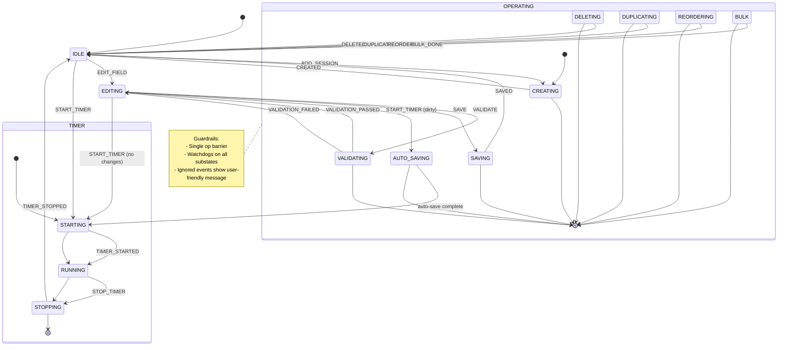

# PROJECT-FSM-SINGLE: Unified Editor FSM (Timer + Sessions)

This document defines a single unified FSM (EditorFSM) to manage all CPT Task Editor interactions: session lifecycle and timer lifecycle. It consolidates the current TimerFSM + SessionFSM to reduce race conditions, centralize validation, and make error recovery uniform.

## Goals
- Most Important Issue: Single source of truth for editor operations (no cross-FSM coordination bugs)
- Strong guardrails and watchdogs to prevent stuck/brittle states
- Server-authoritative invariants
- Minimal DOM coupling via Effects layer (pure FSM core)

## High-level overview
- One FSM: EditorFSM
- Orthogonal concerns are modeled with substates but remain in one machine
- All UI events flow through EditorFSM; legacy jQuery handlers are thin shims that send events
- Effects implement DOM/AJAX, keeping FSM pure/testable

## Scope note — Today page FSM (Deferred)
- All Today page FSM work is deferred to a future phase. This document and the immediate implementation plan focus exclusively on the CPT Task Editor (EditorFSM).
- Do not wire Today page controllers/effects to the FSM in Phases 1–3 below; keep Today behavior as-is until explicitly scheduled.

> Bulk Session operations (multi-select delete/duplicate/move) are explicitly deferred to a later phase. Only single-row operations are in scope for Phases 1–3. Any references to BULK below are placeholders for the deferred phase and are not to be implemented now.


## Phased implementation plan (actionable)

### Phase 1 — Core EditorFSM and Stability
- Scaffold EditorFSM class and Effects interface; add feature flag `PTT_EDITOR_FSM_ENABLED`
- Rehydration on load (server-authoritative)
- Operation barrier (single in-flight op; drop-or-latest queue = 1)
- Guardrail C: debounced user-friendly ignored-event messaging
- Guardrail A: watchdogs for VALIDATING, SAVING, AUTO_SAVING, TIMER.STARTING/STOPPING
- Wire minimal event set: EDIT_FIELD → EDITING; VALIDATE/SAVE; START_TIMER/STOP_TIMER with AUTO_SAVING bridge when dirty
- Update debug panel to show EditorFSM state and next events
- Acceptance: No stuck states in common save/start/stop paths; clear messaging on blocked actions

### Phase 2 — Full Session Operations via EditorFSM
- Route ADD/DELETE/DUPLICATE/REORDER/BULK entirely through EditorFSM
- Watchdogs for CREATING/DELETING/DUPLICATING/REORDERING/BULK (30–45s)
- Enforce timer invariants (RUNNING blocks structural session ops)
- ACF/WP autosave coordination (no parallel save sources)
- Expand E2E test to cover all operations; ensure IDLE/EDITING recovery on all failure paths

### Phase 3 — Consolidation & Hardening
- Remove legacy handlers replaced by EditorFSM
- Unit tests for transition tables (happy paths + errors)
- Error taxonomy mapping → user messages; telemetry-friendly logs
- Performance polish: debounce field changes; reduce DOM queries in Effects
- Finalize admin setting for enabling FSM; keep debug panel protected

### Future/Deferred Phase — Today page FSM
- Integrate Today page under an explicit future phase (separate controller/effects that reuse EditorFSM where appropriate or a lightweight TodayFSM)
- Scope includes: timer controls, data loading, rehydration, and list rendering — not part of Phases 1–3

## Context
```
EditorCtx = {
  postId: number | null,
  sessionIndex: number | null,      // current row being edited or operated on
  running: boolean,                 // timer running?
  runningSessionIndex: number | null,
  runningStartUtc: string | null,
  isDirty: boolean,                 // form edit state
  pendingChanges: Record<string, any>,
  validationErrors: string[],
  bulkSelection: number[] | null,
  op: { name: string, startedAt: number } | null,  // op marker for watchdog
}
```

## States
- IDLE
- EDITING
- OPERATING: parent for long-running operations with guarded substates
  - CREATING
  - VALIDATING
  - SAVING
  - AUTO_SAVING
  - DELETING
  - DUPLICATING
  - REORDERING
  - BULK
- TIMER
  - STARTING
  - RUNNING
  - STOPPING
- ERROR

Notes:
- Transitions between OPERATING and TIMER are serialized by a barrier; only one long-running op at a time.
- EDITING is mutually exclusive with TIMER.STARTING/STOPPING unless AUTO_SAVING bridges them.

## Events
- UI: EDIT_FIELD(field, value), ADD_SESSION, DELETE_SESSION(i), DUPLICATE_SESSION(i), REORDER_SESSION(from,to), BULK_OPERATION(op, indices), UPDATE_SESSION
- Timer: START_TIMER(payload), STOP_TIMER
- Validation/Save: VALIDATE, SAVE
- Effects callbacks: *DONE, *FAILED (e.g., CREATED, SAVED, VALIDATION_PASSED/FAILED, TIMER_STARTED/STOPPED)
- System: REHYDRATE(result), RESET, RETRY

## Invariants (guardrails)
1. Exactly one long-running operation at a time (barrier)
2. When TIMER.RUNNING: disallow ADD/DELETE/DUPLICATE/REORDER/BULK; allow EDIT_FIELD and SAVE; starting a new timer requires AUTO_SAVING when dirty
3. Ignored events produce a user-friendly, debounced message (2s)
4. Every OPERATING or TIMER substate activates a watchdog; timeouts return to a safe state with a clear error
5. WordPress/ACF autosave must not leave FSM in an indeterminate state; effects must resolve to IDLE/EDITING/RUNNING deterministically
6. Server is authoritative on timer conflicts; EditorFSM mirrors server truth on REHYDRATE

## Watchdogs (defaults)
- CREATING/DELETING/DUPLICATING/REORDERING/BULK: 30–45s
- VALIDATING/AUTO_SAVING: 20s
- SAVING: 30s
- TIMER.STARTING/STOPPING: 20s

On timeout: transition to EDITING if there’s an active edit (isDirty || sessionIndex != null); otherwise IDLE. Show contextual message (e.g., "Save operation timed out. Please try again.").

## Operation barrier
- FSM-level flag ctx.op = { name, startedAt }
- If op != null and a new op arrives, queue at most 1 latest op (drop older ones). When the current op completes, execute the queued op or clear it if no longer valid.

## Effects layer (interfaces)
```js
// Networking
startTimer({ postId, sessionIndex, title }) => Promise<{ startedUtc, postId, sessionIndex }>
stopTimer({ postId }) => Promise<{ stoppedUtc }>
rehydrate() => Promise<{ running:boolean, postId?, sessionIndex?, startedUtc?, serverState? }>
createSession({ postId, title }) => Promise<{ sessionIndex }>
validateSession(ctx) => Promise<{ valid:boolean, errors?:string[] }>
saveSession(ctx) => Promise<{ ok:true }>
deleteSession({ postId, sessionIndex }) => Promise<{ ok:true }>
duplicateSession({ postId, sourceIndex }) => Promise<{ newIndex:number }>
reorderSession({ postId, fromIndex, toIndex }) => Promise<{ ok:true }>
performBulk({ postId, op, indices }) => Promise<{ ok:true }>

// UI
updateUI(state, ctx)
showError(message)
showInfo(message)
```

## Core transitions (selected)
- IDLE → EDITING on EDIT_FIELD (set isDirty and pendingChanges)
- IDLE → OPERATING.CREATING on ADD_SESSION
- EDITING → OPERATING.VALIDATING on VALIDATE
- EDITING → OPERATING.SAVING on SAVE
- EDITING → TIMER.STARTING on START_TIMER when not dirty
- EDITING → OPERATING.AUTO_SAVING on START_TIMER when dirty; on AUTO_SAVING→TIMER.STARTING upon completion
- TIMER.RUNNING → TIMER.STOPPING on STOP_TIMER
- OPERATING.* → IDLE/EDITING on *DONE; → ERROR or EDITING on *FAILED
- ERROR → IDLE on RETRY or RESET

All OPERATING.* and TIMER.* entry handlers:
- set ctx.op, start watchdog, disable conflicting actions in UI
All exit handlers:
- clear watchdog, clear ctx.op, updateUI

## Ignored-event policy (Guardrail C)
When an event is invalid for the current state, emit a debounced friendly message:
- EDITING: "Please complete or cancel your current edit before doing that."
- SAVING/VALIDATING/AUTO_SAVING: "Working on your changes… Please wait."
- TIMER.STARTING/STOPPING: "Timer is changing state… Please wait."
- TIMER.RUNNING and event is forbidden: "Stop the current timer before performing that action."

## Rehydration sequence
1. On init: REHYDRATE
2. If response.running: state → TIMER.RUNNING; set context (postId, sessionIndex, startedUtc)
3. Else: state → IDLE; clear running fields
4. UI reflects server truth immediately

## Error taxonomy
- network_error
- permission_error
- validation_error
- conflict_active_elsewhere
- timeout_error

Each error maps to a clear user message and a developer log.

## Verification plan (15-minute E2E)
1. Load CPT editor, ensure rehydrated state matches DB
2. Start timer → RUNNING persists across refresh
3. Try ADD_SESSION while RUNNING → polite block
4. Edit fields, click outside → returns to IDLE if no meaningful changes
5. Update session → SAVING → IDLE; no stuck states
6. Duplicate/reorder/delete/bulk under no-timer and with timer RUNNING (blocked) → correct behavior and messages
7. Simulate stalled requests (devtools offline) → watchdog recovers to IDLE/EDITING with message

## Minimal migration plan from pre-FSM code
- Keep all legacy handlers but replace internals to: EditorFSM.send(event, payload)
- Implement Effects by delegating to existing AJAX endpoints and UI code
- Ship behind a single feature flag: window.PTT_EDITOR_FSM_ENABLED
- Preserve existing debug panel; show single FSM state + next events

## Why single FSM reduces brittleness
- Eliminates cross-machine coordination races (no separate timers for "saving" vs "timer starting")
- Single queue of operations and a single watchdog
- One validation entry point before any operation executes
- Predictable ignored-event behavior with user-friendly guidance

## Optional: state diagram (simplified)
- Top-level: [IDLE, EDITING, OPERATING, TIMER, ERROR]
- OPERATING: [CREATING, VALIDATING, SAVING, AUTO_SAVING, DELETING, DUPLICATING, REORDERING, BULK]
- TIMER: [STARTING, RUNNING, STOPPING]


## Mermaid diagram (simplified)


This spec is designed so we can roll back to pre-FSM code and re-introduce the single EditorFSM gradually: wiring one event at a time while keeping the rest legacy. Once stabilized, remove legacy handlers in a final pass.

